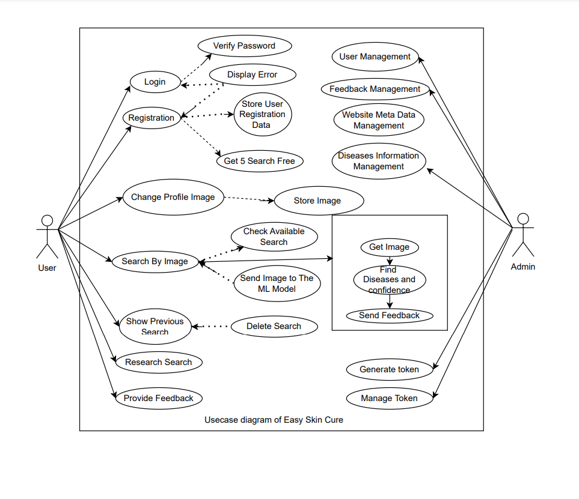
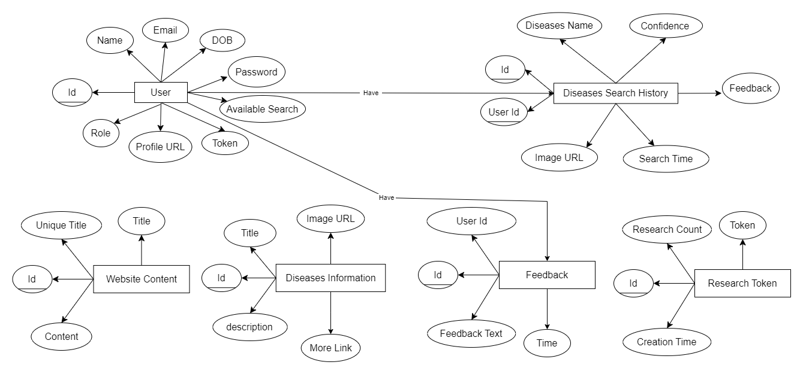

# Skin-Diseases-Detection
## Installation guide
- First you need to setup MySQL using XAMPP. To do that install and open XAMPP and start MySQL.
- Then create a new Database Named
```bash
   skin_diseases_db
```
- Secondly you need to run the backend side.
- If there is any issue to run backend side you need to fix it first.
- After that you can run fontend.
  1. initialize
  ```bash
   npm i
  ```
  2. run
  ```bash
   npm run dev
  ```
- Finally run the AI model 
  

# Usecase Diagram
 

# ER Diagram


